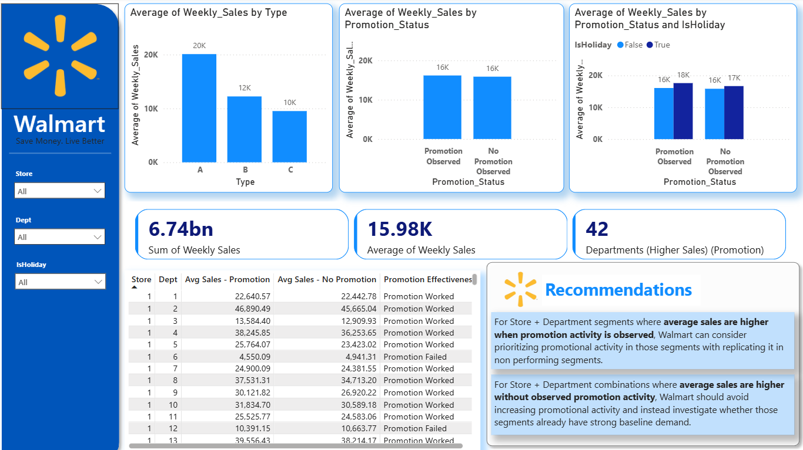

# Walmart Promotion Effectiveness & Store Performance Optimization

An end-to-end Business Analytics project analyzing Walmart's weekly sales and promotional markdown activity to identify store and department segments where promotional activity is associated with different sales performance.

## 📊 Dashboard Preview

## 🎯 Business Problem

Walmart management wants to understand where promotional markdown activity is associated with stronger or weaker weekly sales performance across stores and departments, particularly during major holiday periods.

The objective is to identify segments where promotional activity may be prioritized more effectively rather than applying the same promotional approach across all stores and departments.

> **Note:** This analysis identifies associations between observed markdown activity and sales; it does not establish that promotions caused changes in sales.

## 📁 Dataset

The project uses the **Walmart Recruiting Store Sales Forecasting** dataset.

### Tables used

- **train.csv** — Store, Department, Date, Weekly Sales and Holiday indicator
- **features.csv** — Store-level weekly features including markdown activity, temperature, fuel price, CPI, unemployment and holiday information
- **stores.csv** — Store information including store type and size

### Data Relationships

- `train` ↔ `features`: Store + Date
- `train` ↔ `stores`: Store

## 🛠️ Tools Used

- **Python** — Data validation and preparation
- **Power BI** — Data modeling, analysis and dashboard development
- **DAX** — Analytical measures and promotion comparisons
- **Power Query** — Data transformation and feature preparation

## 📈 Key Dashboard Metrics

- Total Weekly Sales
- Average Weekly Sales
- Departments with higher average sales during observed promotion periods
- Average sales by Store Type
- Promotion vs. No Promotion sales
- Holiday vs. Non-Holiday promotion comparison
- Store + Department promotion effectiveness

## 💡 Business Recommendations

- Prioritize promotional planning selectively across Store + Department segments rather than using a one-size-fits-all approach.
- Review segments where sales are higher when no promotion is observed before increasing promotional activity.
- Consider holiday and non-holiday periods separately when evaluating promotional performance.
- Use Store + Department-level performance to support more targeted promotional allocation.

## 📂 Project Files

- `Walmart.pbix` — Interactive Power BI dashboard
- `Dashboard.png` — Dashboard preview
- `README.md` — Project documentation

## ▶️ How to Open the Dashboard

Download or clone this repository and open:

**`Walmart.pbix`**

using **Microsoft Power BI Desktop**.
